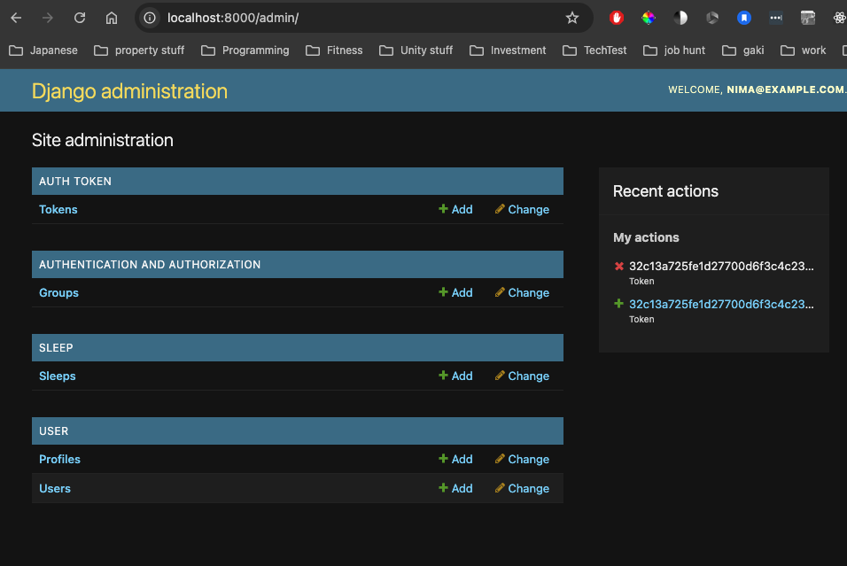
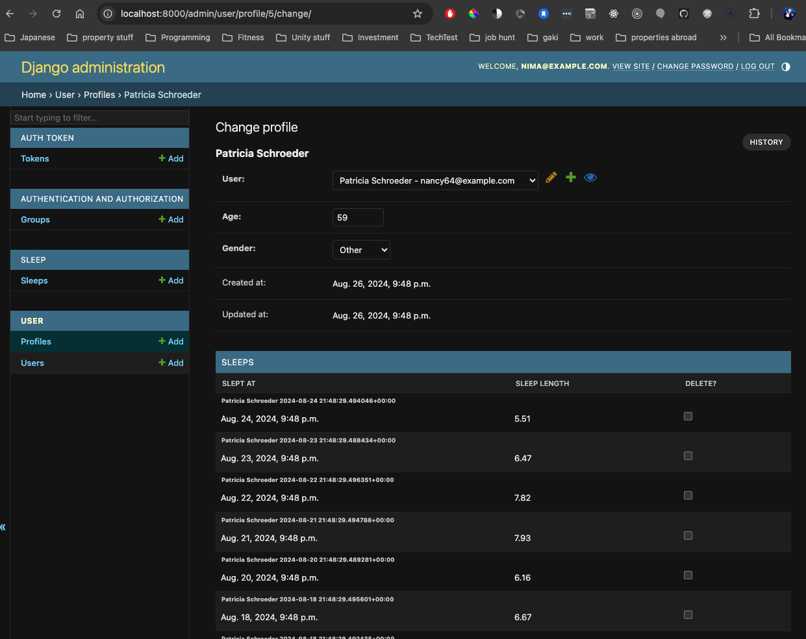

# Django bp


## Usage

To create a django project with config as name of where all settings are

```bash
django-admin startproject config .
```

To create an app

```bash
python manage.py startapp name_of_app
```

seed database

```bash
python manage.py seed_user
python manage.py seed_sleep
```

URL's

<table>
  <tbody>
    <tr>
      <th>Slug</th>
      <th>Protocol</th>
      <th>Body</th>
      <th>Notes</th>
    </tr>
    <tr>
      <td>/signup/</td>
      <td>POST</td>
      <td>{
        "first_name": str,
        "last_name": str,
        "password": str,
        "email": str,
        "profile": {
            "age": int,
            "gender": "Male" | "Female" | "Other"
        }
      }
      </td>
      <td>Creates user and profile</td>
    </tr>
    <tr>
      <td>/login/</td>
      <td>POST</td>
      <td>{
          "email": str,
          "password": str
          }
      </td>
      <td>Reponse will include token and refresh token</td>
    </tr>
    <tr>
      <td>/user/users/</td>
      <td>GET</td>
      <td>N/A</td>
      <td>Get's all useres include headers "Authorization": "Bearer token" and "Content-Type": "application/json"</td>
    </tr>
    <tr>
      <td>/user/{user_id}/sleeps/</td>
      <td>GET</td>
      <td>N/A</td>
      <td>Gets all sleep records for a user</td>
    </tr>
    <tr>
      <td>/user/{user_id}/sleeps/</td>
      <td>POST</td>
      <td>{
          "slept_at": str,
          "sleep_length": int
      }</td>
      <td>Create sleep entry for a user</td>
    </tr>
    <tr>
      <td>/admin/</td>
      <td>N/A</td>
      <td>Entry point to CRM</td>
    </tr>
  </tbody>
</table>

http://localhost:8000

* /signup/              POST
* /login/               POST You'll get a token
* /user/users           GET 
* /user/<id>/sleeps/     GET
* /user/<id>/sleeps/    POST
* /admin/  

Admin site


